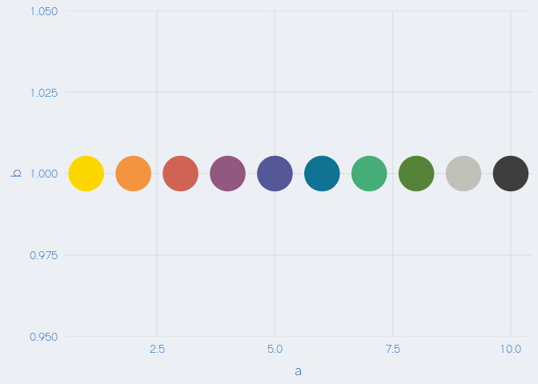
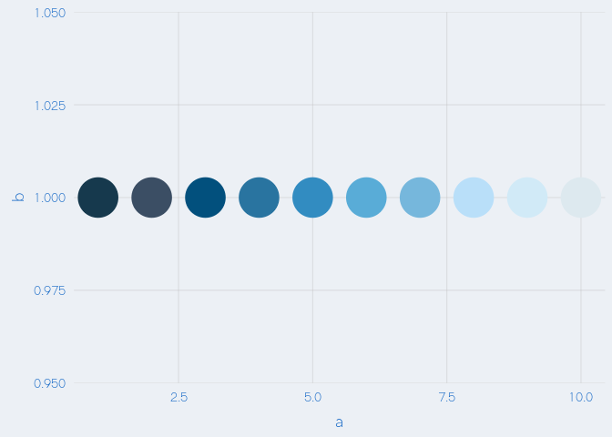
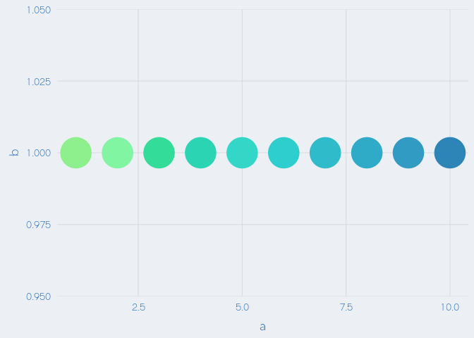
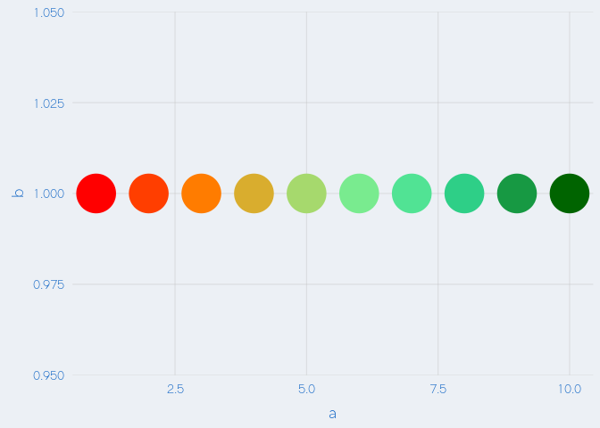

<!-- README.md is generated from README.Rmd. Please edit that file -->
databrew: The R package of databrew
===================================

Installation
------------

``` r
if(!require(devtools)) install.packages("devtools")
install_github('databrew/databrew')
```

Theme
-----

The `theme_databrew()` function, used in conjunction with `ggplot2` objects, styles a plot to the databrew brand:

``` r
library(ggplot2)
library(databrew)
df <- data.frame(a = 1:10,
                 b = rep(1, 10),
                 c = letters[1:10])
g <- ggplot(data = df,
       aes(x = a, 
           y = b,
           color = c)) +
  geom_point(size = 15) +
  theme_databrew() +
  theme(legend.position = 'none')
```

Color palettes
--------------

The `databrew` package includes a few brand-compatible color palettes. The below show their usage:

### Categorical

``` r
n <- length(unique(df$c))
g + scale_color_manual(name = '',
                       values = make_colors(n = n))
```



### Continuous

``` r
g + scale_color_manual(name = '',
                       values = make_colors(n = n,
                                            categorical = FALSE))
```



### Continuous (blue to green)

``` r
g + scale_color_manual(name = '',
                       values = make_colors(n = n,
                                            categorical = FALSE,
                                            b2g = TRUE))
```



### Continuous (red to green)

``` r
g + scale_color_manual(name = '',
                       values = make_colors(n = n,
                                            categorical = FALSE,
                                            r2g = TRUE))
```



Details
-------

Read the [vignette](https://htmlpreview.github.io/?https://github.com/databrew/databrew/blob/master/vignettes/vignette.html) for full details.
